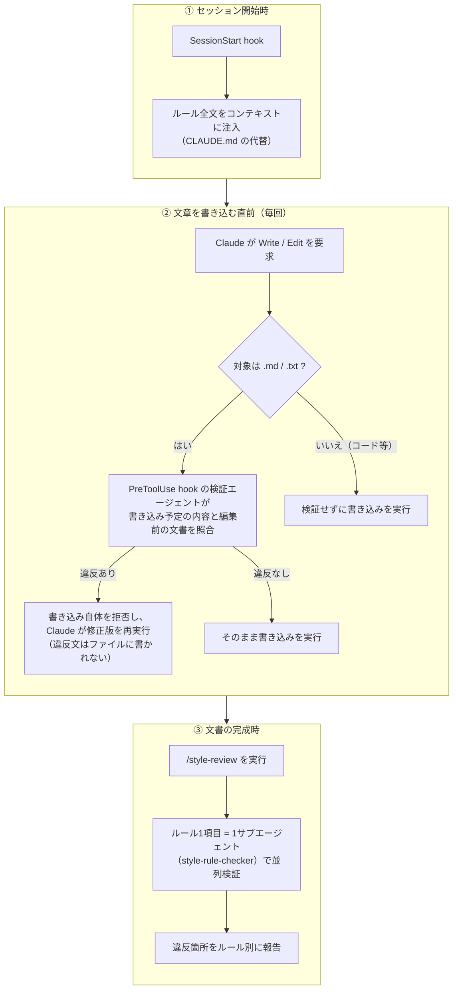

# writing-style

文章スタイルルールを Claude Code に守らせる執筆ガードレール plugin です。

CLAUDE.md にルールを書くだけでは守られません。ルールはコンテキストの先頭に埋もれ、違反しても何も起きないためです。この plugin は次の3層でルールを強制します。



| 層 | 実装 | 動作 |
|----|------|------|
| ① 事前 | SessionStart hook | セッション開始・再開・/clear・compact のたびにルール全文を注入します |
| ② 直前 | PreToolUse hook（検証エージェント） | `.md`/`.txt` への Write/Edit の直前に、書き込み予定の内容と編集前の文書をルールと照合します。違反があれば書き込み自体を拒否し、Claude が修正版を再実行します |
| ③ 完成時 | `style-review` skill | ルール1項目につき1つのサブエージェントを並列起動し、全文をルール別に検証します |

## インストール

```
/plugin marketplace add megmogmog1965/claude-code-writing-style
/plugin install writing-style@claude-code-writing-style
```

## 使い方

通常の執筆では何も操作しません。文書が一段落したら `/style-review <ファイルパス>` で全文検証を実行します（Claude 側からも提案されます）。

## 文章スタイルルール

既定のルールは [rules.md](plugins/writing-style/skills/style-review/references/rules.md) にあります。事実性・構成（章・セクション）・文（センテンス）・語（単語の選択）・箇条書き・ラベル・出典の6グループ14項目で、体言止めの禁止、です・ます調への統一、冗長な言い直しの禁止などを定めています。

## 検証の対象

検証されるのは `.md` と `.txt` への書き込みだけです。それ以外の拡張子（ソースコード等）と、`CLAUDE.md`・`MEMORY.md`・`.claude/` 配下は検証せずに書き込むため、コードを書く作業や調査を妨げません。

## ルールのカスタマイズ

ルールの正本は `plugins/writing-style/skills/style-review/references/rules.md` の1ファイルです。**rules.md を編集したら `scripts/generate-hooks.sh` を実行して hooks.json を再生成し、両方をコミットしてください**。②の検証エージェントだけは、実行環境の制約（後述）によりルール全文を hooks.json のプロンプトへ埋め込んでいるためです。

## 実行環境の制約（実測）

- フック内の検証エージェントは許可プロンプトを出せない実行文脈で動きます。ワークスペース外のファイル（プラグイン実体や `~/.claude/` 配下）の Read は権限拒否され、`${CLAUDE_PLUGIN_ROOT}` も agent hook の prompt フィールドでは置換されません。ルールを hooks.json へ埋め込んでいるのはこのためです
- ワークスペース外のファイルへの書き込みも検証されますが、検証エージェントが編集前の文書を読めないため、文レベルの検査だけになります（重複・文脈接続の検査は省略されます）

## 構成

```
claude-code-writing-style/
├── .claude-plugin/
│   └── marketplace.json          # 単体配布用 catalog
├── scripts/
│   └── generate-hooks.sh         # rules.md から hooks.json を再生成する
└── plugins/writing-style/
    ├── .claude-plugin/
    │   └── plugin.json
    ├── agents/
    │   └── style-rule-checker.md # 単一ルール専任の校閲サブエージェント
    ├── skills/
    │   └── style-review/
    │       ├── SKILL.md          # ルール別並列検証の起動役
    │       └── references/
    │           └── rules.md      # 既定の文章スタイルルール
    └── hooks/
        ├── hooks.json            # SessionStart（注入）+ PreToolUse（書き込み前検証）
        └── bin/
            └── inject-rules.sh   # セッション開始時の注入
```
